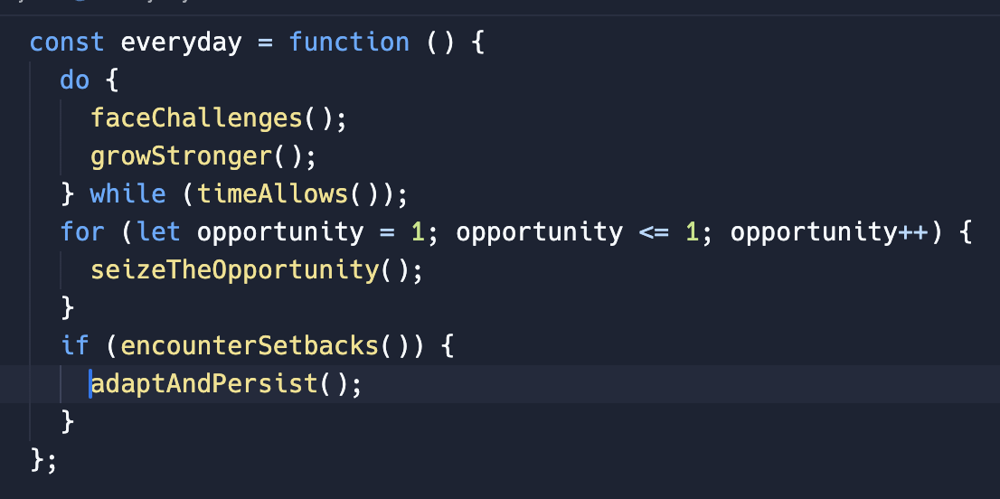

## Erick Gichuki
<h2>I'm a Software Developer with a good experience in tech, always eager to learn new languages.</h2> 

### My GitHub Stats

  

  

  

  

  

### Motivation

  

<!---
ErickGichuki/ErickGichuki is a ✨ special ✨ repository because its `README.md` (this file) appears on your GitHub profile.
You can click the Preview link to take a look at your changes.
--->
